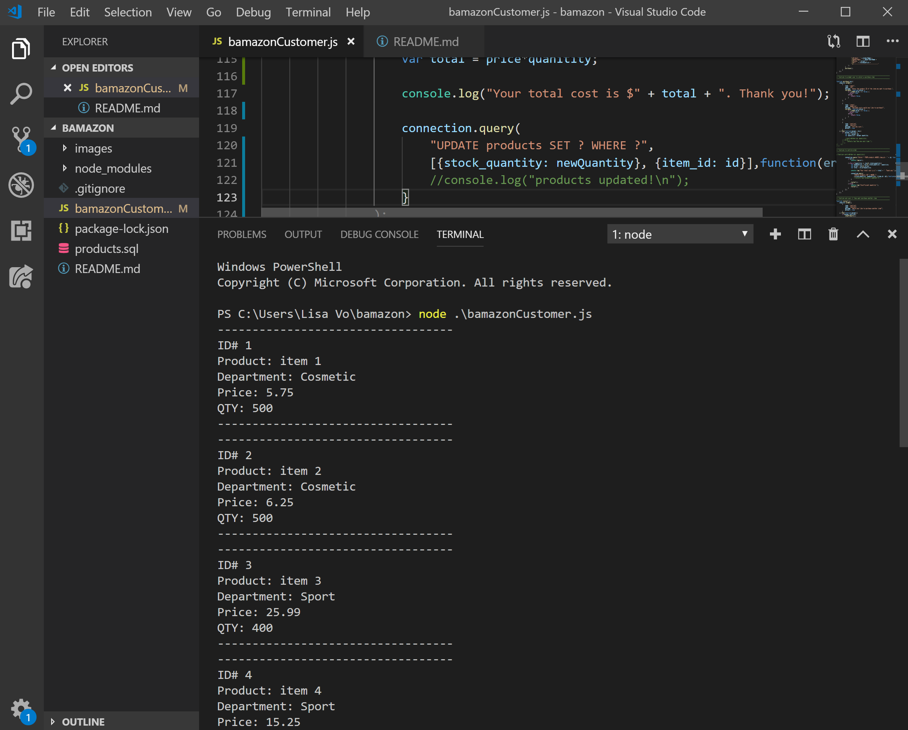
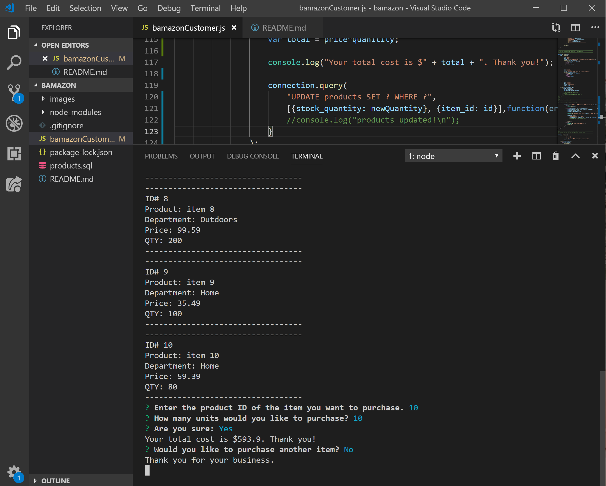

# bamazon
bamazon is an Amazon-like storefront. The app will take in orders from customers and deplete stock from the store's inventory.

# Contributors
@thuyngavo

# About
While in the user's bash/terminal, the user can run node bamazonCustomer.js. Running this application will first display all of the items available for sale. Include the ids, names, and prices of products for sale.

The app will then prompt users with three messages.

    - Enter the product ID of the item you want to purchase.
    - How many units would you like to purchase? 
    - Are you sure?

Once the user has verified their order, the application will check if there enough of the product to meet the customer's request.

If not, the app will display a message of "Insufficient quantity!", and ask the user if they would like to purchase a different product.

However, if there is enough of the product, the program will update the SQL database to reflect the remaining quantity. Once the update goes through, it will display the total cost of the user's purchase and ask if the user woould like to purchase another item.

If the user replies yes, then the updated list of products will be displayed. Otherwise, the display will read "thank you for your business".

# Contact
- Homepage: https://github.com/thuyngavo/thuyngavo.github.io
- e-mail: lisa.vo49@gmail.com
- LinkedIn: https://www.linkedin.com/in/lisa-vo-86a94341/